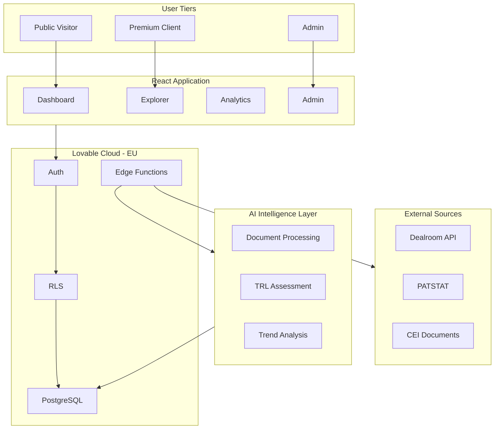
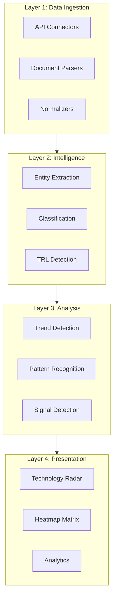
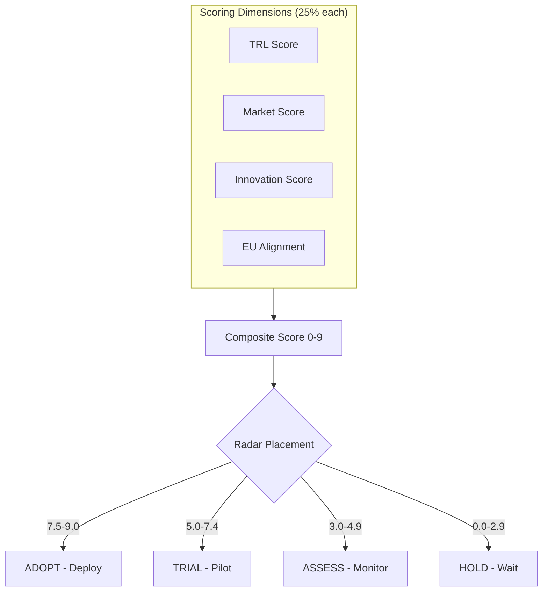
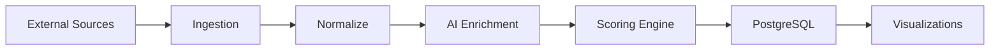

# Annex A: Technical Approach & Methodology

Architecture, AI layers, scoring framework

---

## System Architecture



---

## 4-Layer AI Architecture



---

## 4-Dimension Scoring & Radar Placement



---

## Data Pipeline



---

## Technology Stack

| Layer | Technology |
|-------|------------|
| Frontend | React 18 + TypeScript + Vite |
| Visualization | Recharts + Custom SVG |
| Backend | Lovable Cloud (PostgreSQL + RLS) |
| AI/ML | Lovable AI Gateway |
| Hosting | EU Region (AWS Frankfurt) |

---

## TRL Scale (EU Horizon)

| Level | Phase | Description |
|-------|-------|-------------|
| 1-3 | Research | Basic principles → Proof of concept |
| 4-6 | Development | Lab validation → Prototype demo |
| 7-9 | Deployment | Operational demo → Proven system |

---

## Radar Rings

| Ring | Score Range | Action |
|------|-------------|--------|
| 🟢 Adopt | 7.5 - 9.0 | Ready for deployment |
| 🔵 Trial | 5.0 - 7.4 | Suitable for pilots |
| 🟡 Assess | 3.0 - 4.9 | Worth monitoring |
| 🔴 Hold | 0.0 - 2.9 | Not ready for adoption |

---

## Composite Score Formula

```
Score = (TRL × 0.25) + (Market × 0.25) + (Innovation × 0.25) + (EU × 0.25)
```

Each dimension is normalized to a 0-9 scale before applying weights.
