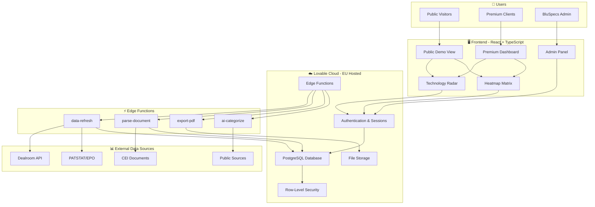
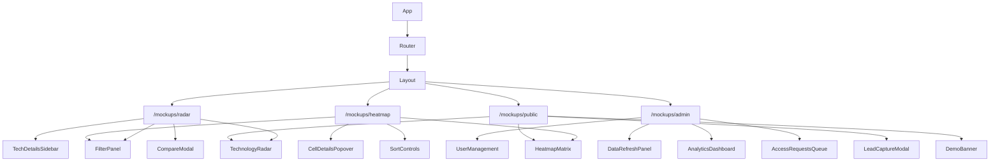
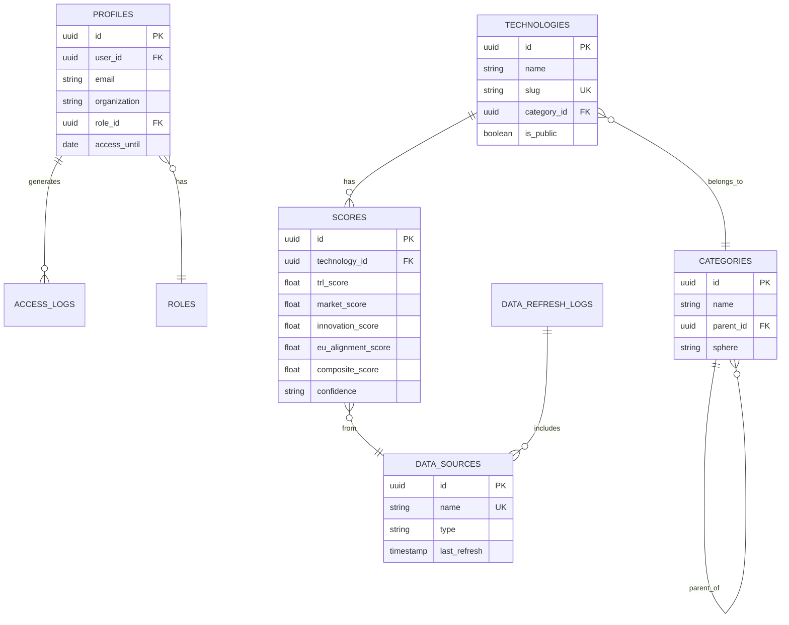
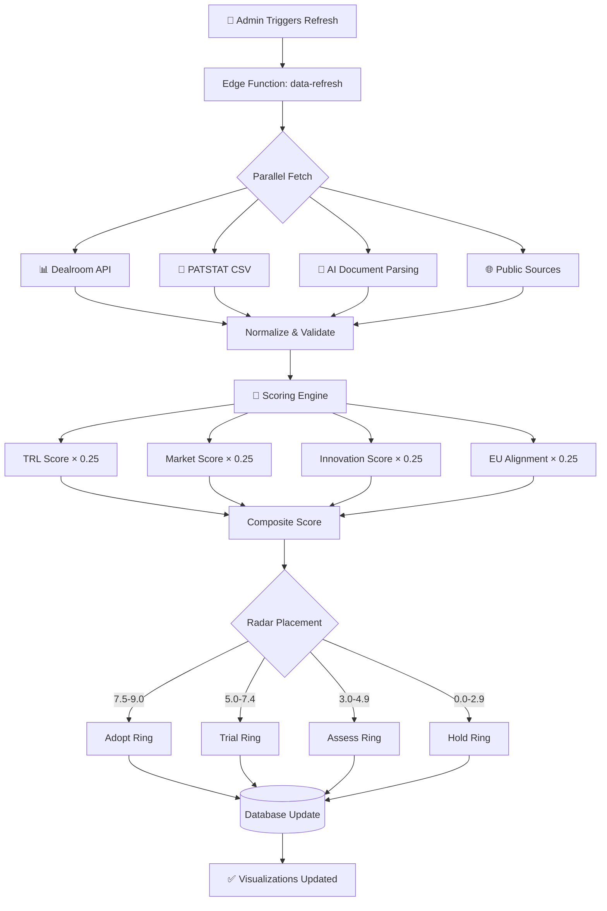
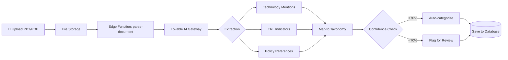
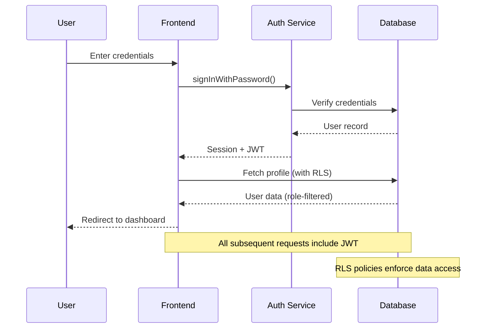

# Annex A: Technical Architecture

## Technology Stack

| Layer | Technology | Rationale |
|-------|------------|-----------|
| **Frontend** | React 18, TypeScript, Tailwind CSS | Modern component architecture, type safety, responsive design |
| **Visualizations** | Recharts | Production-ready charting library with accessibility support |
| **Backend** | Lovable Cloud (PostgreSQL) | EU-hosted, built-in auth, auto-scaling, ISO 27001 infrastructure |
| **AI Processing** | Lovable AI Gateway | Document parsing, TRL assessment, no external API keys required |
| **State Management** | TanStack Query | Server state caching, optimistic updates, background sync |
| **Hosting** | EU Region (AWS Frankfurt/Ireland) | GDPR compliance, data residency guarantee |

---

## System Architecture



---

## Frontend Architecture

### Component Hierarchy



### Key Components

| Component | Purpose | Key Features |
|-----------|---------|--------------|
| **TechnologyRadar** | Circular quadrant visualization | 4 domains, 4 maturity rings, hover/click interactions |
| **HeatmapMatrix** | Grid-based maturity landscape | Sortable columns, expandable rows, color-coded cells |
| **FilterPanel** | Multi-criteria filtering | Domain, geography, TRL range, confidence level |
| **ExportDialog** | Data export functionality | CSV, PDF report, PNG/SVG chart export |
| **AdminPanel** | User & data management | User CRUD, access grants, data refresh trigger |

---

## Backend Architecture

### Database Schema Overview



> **Full schema:** See [Database Schema](../visuals/database-schema.md) for complete ERD with all fields

### Core Tables

| Table | Purpose | RLS Policy |
|-------|---------|------------|
| `profiles` | User information & access level | Own profile only; Admin full access |
| `technologies` | Technology registry | Public: `is_public=true`; Premium: all |
| `scores` | Maturity assessments | Linked to technology visibility |
| `categories` | Taxonomy hierarchy | Public read |
| `data_sources` | Integration configs | Admin only |
| `access_logs` | Audit trail | Admin only |

---

## Edge Functions

### Function Catalog

| Function | Trigger | Purpose |
|----------|---------|---------|
| `data-refresh` | Manual (Admin button) | Fetch all sources, normalize, recalculate scores |
| `parse-document` | File upload | AI extraction from PDF/PPT via Lovable AI Gateway |
| `export-pdf` | User request | Generate branded PDF report with charts |
| `ai-categorize` | Data refresh | Auto-categorize technologies using AI |

### Data Refresh Flow



### AI Document Processing



---

## Security Architecture

### Authentication Flow



### Access Control Matrix

| Resource | Public | Premium | Admin |
|----------|--------|---------|-------|
| Sample technologies (5-10) | ✅ Read | ✅ Read | ✅ Full |
| Full technology set | ❌ | ✅ Read | ✅ Full |
| Export CSV | ❌ | ✅ | ✅ |
| Export PDF | ❌ | ✅ | ✅ |
| User management | ❌ | ❌ | ✅ |
| Data refresh | ❌ | ❌ | ✅ |
| Analytics | ❌ | ❌ | ✅ |

### Row-Level Security

```sql
-- Example: Premium users see all technologies
CREATE POLICY "premium_see_all" ON technologies
  FOR SELECT
  USING (
    is_public = true 
    OR 
    EXISTS (
      SELECT 1 FROM profiles 
      WHERE profiles.user_id = auth.uid() 
      AND profiles.role_id IN (
        SELECT id FROM roles WHERE name IN ('premium', 'admin')
      )
    )
  );
```

---

## Infrastructure

### Deployment Architecture

```
┌─────────────────────────────────────────────────────────────┐
│                    CDN (Global Edge)                        │
└─────────────────────────────┬───────────────────────────────┘
                              │
┌─────────────────────────────▼───────────────────────────────┐
│              Lovable Hosting (EU Region)                    │
│  ┌─────────────────────────────────────────────────────┐   │
│  │                    Frontend                          │   │
│  │         React SPA (Static Assets)                    │   │
│  └─────────────────────────────────────────────────────┘   │
└─────────────────────────────┬───────────────────────────────┘
                              │
┌─────────────────────────────▼───────────────────────────────┐
│            Lovable Cloud (EU - AWS Frankfurt)               │
│  ┌──────────────┐  ┌──────────────┐  ┌──────────────┐      │
│  │    Auth      │  │  PostgreSQL  │  │    Storage   │      │
│  │   Service    │  │   Database   │  │   Buckets    │      │
│  └──────────────┘  └──────────────┘  └──────────────┘      │
│                                                             │
│  ┌─────────────────────────────────────────────────────┐   │
│  │              Edge Functions (Deno)                   │   │
│  │   data-refresh │ parse-document │ export-pdf        │   │
│  └─────────────────────────────────────────────────────┘   │
└─────────────────────────────────────────────────────────────┘
```

### Performance Targets

| Metric | Target | Rationale |
|--------|--------|-----------|
| Initial Load | < 3s | CDN-cached static assets |
| Visualization Render | < 500ms | Client-side rendering with cached data |
| Data Refresh | < 5 min | Parallel API calls, batch processing |
| API Response (p95) | < 200ms | PostgreSQL with proper indexing |

---

## Technical Advantages

| Advantage | Benefit |
|-----------|---------|
| **No vendor lock-in** | Standard React/TypeScript, PostgreSQL, exportable data |
| **EU compliance built-in** | Data residency in EU, ISO 27001 certified infrastructure |
| **Scalable architecture** | Handles growth from 10 to 10,000+ users without changes |
| **AI-ready** | Lovable AI Gateway pre-integrated for document processing |
| **Maintainable** | Clean component architecture, typed APIs, documented patterns |

---

## API Reference

### Public Endpoints

| Endpoint | Method | Auth | Description |
|----------|--------|------|-------------|
| `/rest/v1/technologies` | GET | Optional | List technologies (RLS-filtered) |
| `/rest/v1/categories` | GET | None | Technology taxonomy |
| `/functions/v1/export-pdf` | POST | Required | Generate PDF report |

### Admin Endpoints

| Endpoint | Method | Auth | Description |
|----------|--------|------|-------------|
| `/rest/v1/profiles` | GET/POST/PATCH/DELETE | Admin | User management |
| `/functions/v1/data-refresh` | POST | Admin | Trigger data refresh |
| `/rest/v1/access_logs` | GET | Admin | View audit trail |

---

> **Related Documentation:**
> - [Data Flow Diagrams](../visuals/data-flow-diagrams.md)
> - [Database Schema](../visuals/database-schema.md)
> - [Methodology Framework](./Annex-B-Methodology-Framework.md)
