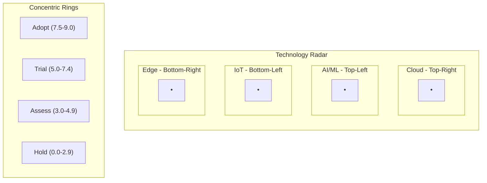
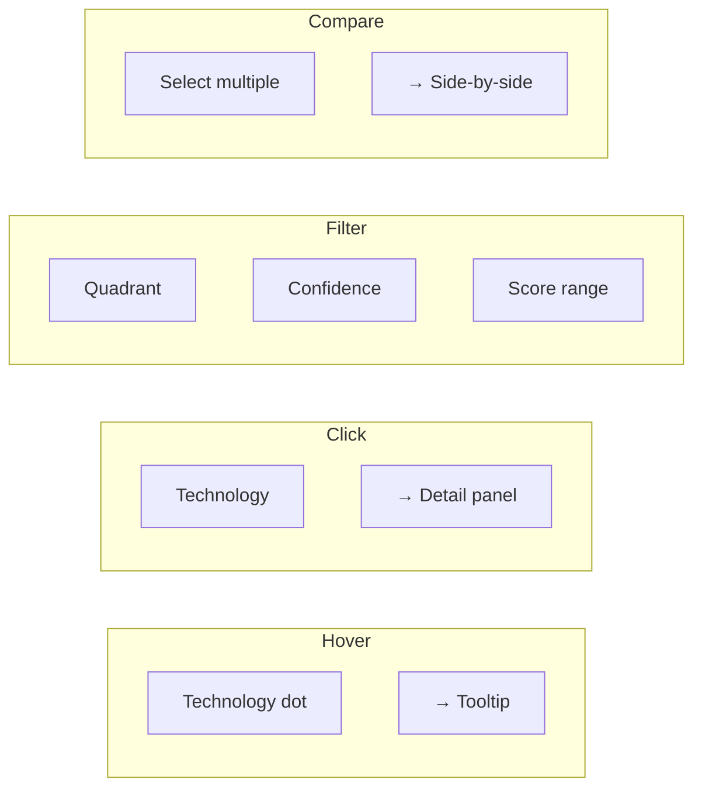

# Annex B: Visual Mockups

UI layouts, design system, interaction patterns

---

## Live Interactive Mockups

> **Live mockups available at:** `/mockups` in the application

| View | URL | Description |
|------|-----|-------------|
| Technology Radar | `/mockups/radar` | Circular quadrant-based visualization |
| Heatmap Matrix | `/mockups/heatmap` | Grid-based maturity landscape |
| Admin Panel | `/mockups/admin` | User and data management interface |
| Public Demo | `/mockups/public` | Limited public-facing view |

---

## Technology Radar Layout

---

## User Interaction Patterns

---

## Radar Quadrants

| Quadrant | Position | Color | Icon |
|----------|----------|-------|------|
| Cloud Technologies | Top-Right | 🔵 Blue | ☁️ |
| AI/ML | Top-Left | 🟣 Purple | 🤖 |
| IoT | Bottom-Left | 🟠 Orange | 📡 |
| Edge Computing | Bottom-Right | 🟢 Green | ⚡ |

---

## Heatmap Color Scale

| Score Range | Color | Meaning |
|-------------|-------|---------|
| 8.0 - 9.0 | 🟢 Deep Green | Highly mature, ready for adoption |
| 6.0 - 7.9 | 🟢 Light Green | Mature, worth trialing |
| 4.0 - 5.9 | 🟡 Yellow | Developing, assess carefully |
| 2.0 - 3.9 | 🟠 Orange | Early stage, monitor |
| 0.0 - 1.9 | 🔴 Red | Nascent, hold |
