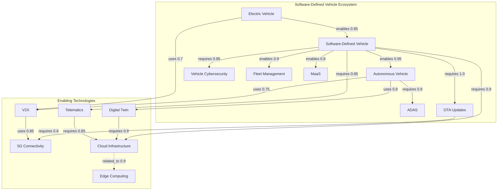
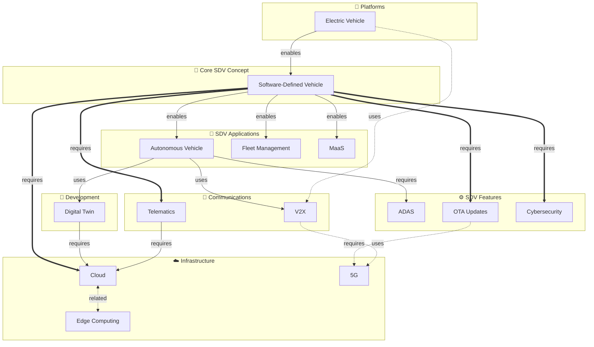

# AI-CE Heatmap: SDV Knowledge Graph & Ontology Export
## Complete Schema and Relationship Definitions

**Export Date:** 2026-02-05  
**Platform:** AI-CE Heatmap for Software-Defined Vehicle Technology Intelligence

---

## Table of Contents

1. [Overview](#overview)
2. [Ontology Schema](#ontology-schema)
3. [Domain Definitions](#domain-definitions)
4. [Concept Definitions](#concept-definitions)
5. [Semantic Relationships](#semantic-relationships)
6. [Keyword-to-Concept Mappings](#keyword-to-concept-mappings)
7. [Technology Co-occurrence Network](#technology-co-occurrence-network)
8. [Clustering Logic](#clustering-logic)
9. [Database Functions](#database-functions)

---

## Overview

The AI-CE Heatmap knowledge graph models the **Software-Defined Vehicle (SDV) ecosystem** through a multi-layered ontology:

```
┌─────────────────────────────────────────────────────────────────┐
│                    ONTOLOGY LAYER                               │
│  ┌─────────────┐    ┌─────────────┐    ┌──────────────────┐    │
│  │   Domains   │───▶│  Concepts   │───▶│  Relationships   │    │
│  │  (2 total)  │    │ (14 total)  │    │    (17 total)    │    │
│  └─────────────┘    └─────────────┘    └──────────────────┘    │
└─────────────────────────────────────────────────────────────────┘
                              │
                              ▼
┌─────────────────────────────────────────────────────────────────┐
│                    TAXONOMY LAYER                               │
│  ┌──────────────────┐    ┌─────────────────────────────────┐   │
│  │ technology_      │───▶│ keyword_industry_mappings       │   │
│  │ keywords (60+)   │    │ (Dealroom taxonomy alignment)   │   │
│  └──────────────────┘    └─────────────────────────────────┘   │
└─────────────────────────────────────────────────────────────────┘
                              │
                              ▼
┌─────────────────────────────────────────────────────────────────┐
│                 CO-OCCURRENCE LAYER                             │
│  ┌──────────────────────┐    ┌─────────────────────────────┐   │
│  │ technology_          │───▶│ Detected Clusters           │   │
│  │ cooccurrences        │    │ (EV, SDV, Logistics, etc.)  │   │
│  └──────────────────────┘    └─────────────────────────────┘   │
└─────────────────────────────────────────────────────────────────┘
```

---

## Ontology Schema

### Database Tables

```sql
-- Ontology Domains (top-level categories)
CREATE TABLE ontology_domains (
  id SERIAL PRIMARY KEY,
  code TEXT NOT NULL UNIQUE,
  name TEXT NOT NULL,
  description TEXT,
  created_at TIMESTAMP DEFAULT now()
);

-- Ontology Concepts (technologies/capabilities)
CREATE TABLE ontology_concepts (
  id SERIAL PRIMARY KEY,
  domain_id INTEGER REFERENCES ontology_domains(id),
  name TEXT NOT NULL,
  acronym TEXT,
  description TEXT,
  synonyms TEXT[] DEFAULT '{}',
  is_core BOOLEAN DEFAULT false,
  created_at TIMESTAMP DEFAULT now()
);

-- Semantic Relationships between concepts
CREATE TABLE ontology_relationships (
  id SERIAL PRIMARY KEY,
  concept_from_id INTEGER REFERENCES ontology_concepts(id),
  concept_to_id INTEGER REFERENCES ontology_concepts(id),
  relationship_type TEXT NOT NULL,  -- 'requires', 'enables', 'uses', 'related_to'
  strength NUMERIC DEFAULT 1.0,     -- 0.0 to 1.0
  description TEXT,
  created_at TIMESTAMP DEFAULT now()
);

-- Technology Keywords (operational taxonomy)
CREATE TABLE technology_keywords (
  id UUID PRIMARY KEY DEFAULT gen_random_uuid(),
  keyword TEXT NOT NULL,
  display_name TEXT NOT NULL,
  description TEXT,
  aliases TEXT[],
  source keyword_source,  -- 'cei_sphere', 'dealroom', 'manual'
  parent_keyword_id UUID REFERENCES technology_keywords(id),
  ontology_concept_id INTEGER REFERENCES ontology_concepts(id),
  is_active BOOLEAN DEFAULT true
);

-- Technology Co-occurrences (emergent relationships)
CREATE TABLE technology_cooccurrences (
  id UUID PRIMARY KEY DEFAULT gen_random_uuid(),
  keyword_id_a UUID NOT NULL REFERENCES technology_keywords(id),
  keyword_id_b UUID NOT NULL REFERENCES technology_keywords(id),
  cooccurrence_count INTEGER DEFAULT 1,
  source_documents INTEGER DEFAULT 1,
  avg_combined_relevance NUMERIC DEFAULT 0.5,
  last_seen_at TIMESTAMP DEFAULT now()
);
```

---

## Domain Definitions

| ID | Code | Name | Description |
|----|------|------|-------------|
| 1 | `SDV` | **Software-Defined Vehicle Ecosystem** | Technologies directly enabling or using software-defined vehicles |
| 2 | `ENABLING` | **Enabling Technologies** | Infrastructure and platform technologies that SDV depends on |

---

## Concept Definitions

### Domain: Software-Defined Vehicle Ecosystem (SDV)

| ID | Name | Acronym | Core | Description | Synonyms |
|----|------|---------|------|-------------|----------|
| 1 | **Software-Defined Vehicle** | SDV | ✅ Yes | Vehicles where features, functions, and capabilities are defined and updated through software rather than hardware | Software Defined Vehicle, SDV, Vehicle as Software, Connected Car, Connected Vehicle, Vehicle Software, Automotive Software, In-Vehicle Software, Vehicle Platform, Automotive Technology |
| 2 | **Autonomous Vehicle** | AV | No | Vehicles capable of operating without human driver - a prime use case for SDV architecture | Autonomous Driving, Self-Driving Vehicle, Driverless Vehicle, autonomous car, self-driving |
| 3 | **ADAS** | ADAS | No | Driver assistance features that are software-defined and updatable in SDV | Advanced Driver Assistance Systems, Driver Assistance, Collision Avoidance, Lane Keeping, Adaptive Cruise Control, Safety Systems |
| 4 | **OTA Updates** | OTA | No | Core capability of SDV - ability to update vehicle software remotely | Over-the-Air Updates, OTA, Remote Updates, Software Updates, Firmware Updates, Software Deployment, Remote Vehicle Management, Connected Services |
| 5 | **Vehicle Cybersecurity** | - | No | Critical for SDV as software-defined systems have expanded attack surface | Automotive Cybersecurity, Vehicle Security, Automotive Security |
| 6 | **Electric Vehicle** | EV | No | Electric vehicles are natural platforms for SDV architecture due to electronic architecture | EV, BEV, Battery Electric Vehicle, Electric Car, E-Vehicle, Charging Infrastructure, EV Charging, Charge Point, Electric Mobility |
| 11 | **Fleet Management** | - | No | SDV architecture enables centralized fleet management and updates | Fleet Software, Fleet Operations, Fleet Optimization, Commercial Fleet, Fleet Tracking, Vehicle Fleet Management |
| 12 | **MaaS** | MaaS | No | Service models enabled by software-defined fleet vehicles | Mobility as a Service, Mobility Service, Shared Mobility |

### Domain: Enabling Technologies

| ID | Name | Acronym | Core | Description | Synonyms |
|----|------|---------|------|-------------|----------|
| 7 | **V2X** | V2X | No | Communication systems enabling SDV to interact with environment and grid | Vehicle to Everything, V2V, V2I, V2G, Vehicle to Vehicle, Vehicle to Infrastructure |
| 8 | **5G Connectivity** | 5G | No | High-speed connectivity enabling real-time SDV updates and V2X communication | 5G, 6G, 5G Network, Mobile Connectivity, Cellular V2X |
| 9 | **Telematics** | - | No | Data collection systems that feed SDV decision-making and updates | Vehicle Telematics, Automotive Telematics, Connected Car Data, Telemetry, Vehicle Data, Vehicle Monitoring, Fleet Telematics |
| 10 | **Digital Twin** | DT | No | Virtual representation of vehicles used for SDV testing and optimization | Digital Twin, Vehicle Digital Twin, Virtual Twin, Vehicle Simulation, Virtual Testing, Simulation Platform, Virtual Vehicle, Model-Based Development |
| 13 | **Cloud Infrastructure** | - | No | Backend infrastructure supporting SDV updates, data processing, and AI | Cloud Platform, Cloud Computing, Vehicle Cloud |
| 14 | **Edge Computing** | - | No | Local processing capability in SDV for real-time decisions | Edge Processing, Vehicle Edge, Distributed Computing |

---

## Semantic Relationships

### Relationship Types

| Type | Description | Cardinality |
|------|-------------|-------------|
| `requires` | Concept A fundamentally depends on Concept B | Strong dependency |
| `enables` | Concept A makes Concept B possible or practical | Enablement |
| `uses` | Concept A leverages Concept B as a tool/capability | Utilization |
| `related_to` | Concepts are associated but without direct dependency | Association |

### All Relationships



### Relationship Table

| From Concept | Relationship | Strength | To Concept | Description |
|--------------|--------------|----------|------------|-------------|
| Software-Defined Vehicle | **requires** | 1.0 | OTA Updates | SDV fundamentally requires over-the-air update capability |
| Software-Defined Vehicle | **requires** | 0.95 | Vehicle Cybersecurity | Software-defined systems must have strong cybersecurity |
| Software-Defined Vehicle | **requires** | 0.9 | Cloud Infrastructure | SDV requires cloud backend for updates and data processing |
| Software-Defined Vehicle | **requires** | 0.85 | Telematics | SDV needs telemetry data for optimization and updates |
| Autonomous Vehicle | **requires** | 0.9 | ADAS | Autonomous vehicles build upon ADAS foundations |
| OTA Updates | **requires** | 0.8 | 5G Connectivity | OTA updates benefit from high-speed 5G connectivity |
| Digital Twin | **requires** | 0.9 | Cloud Infrastructure | Digital twins run on cloud infrastructure |
| Telematics | **requires** | 0.85 | Cloud Infrastructure | Telemetry data is processed in the cloud |
| Software-Defined Vehicle | **enables** | 0.95 | Autonomous Vehicle | SDV architecture enables autonomous driving capabilities through software |
| Software-Defined Vehicle | **enables** | 0.9 | Fleet Management | SDV enables centralized fleet management and updates |
| Software-Defined Vehicle | **enables** | 0.8 | MaaS | SDV architecture enables flexible mobility services |
| Electric Vehicle | **enables** | 0.85 | Software-Defined Vehicle | EVs provide ideal electronic architecture for SDV |
| Autonomous Vehicle | **uses** | 0.75 | V2X | Autonomous vehicles use V2X for enhanced awareness |
| Autonomous Vehicle | **uses** | 0.8 | Digital Twin | Autonomous systems are tested and validated via digital twins |
| Electric Vehicle | **uses** | 0.7 | V2X | EVs can participate in vehicle-to-grid communication |
| V2X | **uses** | 0.85 | 5G Connectivity | V2X communication leverages 5G for low latency |
| Cloud Infrastructure | **related_to** | 0.9 | Edge Computing | Cloud and edge work together in SDV architecture |

---

## Keyword-to-Concept Mappings

The following technology keywords are linked to formal ontology concepts:

| Keyword (display_name) | Ontology Concept | Domain |
|------------------------|------------------|--------|
| Software Defined Vehicle | Software-Defined Vehicle | SDV Ecosystem |
| Vehicle as Software | Software-Defined Vehicle | SDV Ecosystem |
| Autonomous Vehicle | Autonomous Vehicle | SDV Ecosystem |
| Autonomous Driving | Autonomous Vehicle | SDV Ecosystem |
| Electric Vehicle | Electric Vehicle | SDV Ecosystem |
| Battery Electric Vehicle | Electric Vehicle | SDV Ecosystem |
| E-Vehicle | Electric Vehicle | SDV Ecosystem |
| Fleet Management | Fleet Management | SDV Ecosystem |
| Telematics | Telematics | Enabling Technologies |
| Vehicle to Everything | V2X | Enabling Technologies |
| Vehicle to Grid | V2X | Enabling Technologies |

---

## Technology Co-occurrence Network

Co-occurrences are derived from **quality companies** (total_funding_eur > 0 OR employees_count > 10). This creates an emergent knowledge graph based on market reality rather than just semantic definitions.

### Top 30 Co-occurring Technology Pairs

| Rank | Technology A | Technology B | Shared Companies | Avg Relevance |
|------|--------------|--------------|------------------|---------------|
| 1 | EV Charging | Electric Mobility | 21 | 0.75 |
| 2 | EV Charging | Software Defined Vehicle | 21 | 0.70 |
| 3 | Electric Mobility | Software Defined Vehicle | 21 | 0.70 |
| 4 | EV Charging | Battery Electric Vehicle | 20 | 0.70 |
| 5 | Battery Electric Vehicle | Electric Mobility | 20 | 0.70 |
| 6 | Battery Electric Vehicle | Software Defined Vehicle | 20 | 0.70 |
| 7 | Software Defined Vehicle | Autonomous Driving | 14 | 0.70 |
| 8 | Logistics Tech | Logistics | 12 | 0.70 |
| 9 | Vehicle to Everything | EV Charging | 10 | 0.75 |
| 10 | Vehicle to Everything | Bidirectional Charging | 10 | 0.70 |
| 11 | Vehicle to Everything | Vehicle to Grid | 10 | 0.625 |
| 12 | Bidirectional Charging | EV Charging | 10 | 0.70 |
| 13 | Bidirectional Charging | Vehicle to Grid | 10 | 0.70 |
| 14 | EV Charging | Vehicle to Grid | 10 | 0.775 |
| 15 | Supply Chain Management | Supply Chain | 9 | 0.70 |
| 16 | Smart City | Smart Cities | 6 | 0.517 |
| 17 | EV Battery | Storage Battery Systems | 5 | 0.70 |
| 18 | EV Battery | Battery Electric Vehicle | 5 | 0.70 |
| 19 | Storage Battery Systems | Battery Electric Vehicle | 5 | 0.70 |
| 20 | Energy Management Systems | Smart Cities | 3 | 0.583 |
| 21 | Smart City | Energy Management Systems | 3 | 0.583 |
| 22 | Smart City | Electric Mobility | 3 | 0.517 |
| 23 | Vehicle to Grid | Smart Recharging | 2 | 0.875 |
| 24 | Energy Management Systems | Smart Grid | 2 | 0.50 |
| 25 | Energy Management Systems | Vehicle to Grid | 2 | 0.525 |

### Detected Clusters (from clustering algorithm)

The platform uses a **greedy clustering algorithm** that assigns technologies to clusters based on their strongest connections:

```
EV Charging Cluster
├── EV Charging
├── Electric Mobility
├── Software Defined Vehicle
├── Battery Electric Vehicle
├── Autonomous Driving
└── Combined Funding: €XXB

V2X Cluster
├── Vehicle to Everything
├── Bidirectional Charging
├── Vehicle to Grid
├── AV Labeling
└── Combined Funding: €XXB

Logistics Cluster
├── Logistics Tech
├── Logistics
├── Supply Chain Management
├── Supply Chain
└── Combined Funding: €XXB
```

---

## Clustering Logic

The clustering algorithm in `useTechnologyOntology.ts`:

```typescript
// Simple cluster detection - group nodes by their strongest connection
function detectClusters(
  nodes: TechnologyNode[],
  edges: TechnologyEdge[]
): Map<string, string[]> {
  const clusters = new Map<string, string[]>();
  const assigned = new Set<string>();

  // Sort edges by weight (strongest first)
  const sortedEdges = [...edges].sort((a, b) => b.weight - a.weight);

  // Assign nodes to clusters based on strongest connections
  for (const edge of sortedEdges) {
    const sourceAssigned = assigned.has(edge.source);
    const targetAssigned = assigned.has(edge.target);

    if (!sourceAssigned && !targetAssigned) {
      // Create new cluster with both nodes
      const clusterId = edge.source;
      clusters.set(clusterId, [edge.source, edge.target]);
      assigned.add(edge.source);
      assigned.add(edge.target);
    } else if (!sourceAssigned && targetAssigned) {
      // Add source to target's cluster
      for (const [clusterId, members] of clusters.entries()) {
        if (members.includes(edge.target)) {
          members.push(edge.source);
          assigned.add(edge.source);
          break;
        }
      }
    } else if (sourceAssigned && !targetAssigned) {
      // Add target to source's cluster
      for (const [clusterId, members] of clusters.entries()) {
        if (members.includes(edge.source)) {
          members.push(edge.target);
          assigned.add(edge.target);
          break;
        }
      }
    }
  }

  return clusters;
}
```

---

## Database Functions

### Network Centrality Calculation (PageRank-style)

```sql
CREATE OR REPLACE FUNCTION calculate_network_centrality()
RETURNS void AS $$
DECLARE
  damping_factor NUMERIC := 0.85;
  iterations INTEGER := 20;
  -- Implementation uses technology_cooccurrences to calculate
  -- centrality scores stored in technologies.network_centrality
END;
$$ LANGUAGE plpgsql;
```

### Co-occurrence Population from Companies

```sql
CREATE OR REPLACE FUNCTION populate_cooccurrences_from_companies()
RETURNS TABLE(
  pairs_created INTEGER,
  pairs_updated INTEGER,
  quality_companies_used INTEGER
) AS $$
  -- Uses keyword_company_mapping to find companies with multiple keywords
  -- Only considers "quality" companies: funding > 0 OR employees > 10
  -- Creates/updates technology_cooccurrences records
$$;
```

### Upsert Co-occurrence Helper

```sql
CREATE OR REPLACE FUNCTION upsert_cooccurrence(
  kw_a UUID,
  kw_b UUID,
  relevance_score NUMERIC DEFAULT 0.5
)
RETURNS void AS $$
  -- Ensures keyword_id_a < keyword_id_b for consistency
  -- Increments cooccurrence_count if exists, creates if not
$$;
```

---

## Visual Representation

### Full Ontology Graph



---

## Usage Notes for External AI Assistants

When reasoning about this ontology:

1. **SDV is the central hub** - Most technologies either enable SDV or are enabled by it
2. **Strength values matter** - A requirement with strength 1.0 is fundamental; 0.7 is important but not critical
3. **Co-occurrences are empirical** - They reflect actual market clustering, not just semantic relationships
4. **Quality filter is key** - Co-occurrences only count companies with real traction (funding/employees)
5. **Synonyms enable fuzzy matching** - Each concept has multiple surface forms for NLP/search

---

*Export generated by AI-CE Heatmap Platform*
