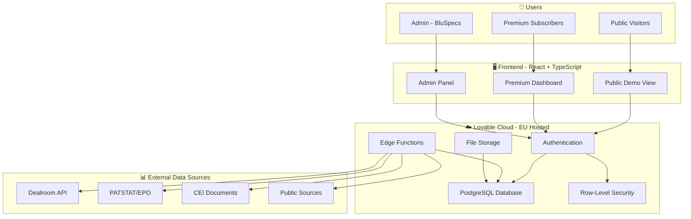
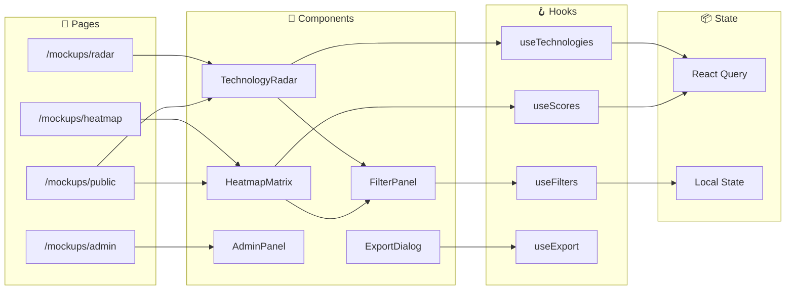
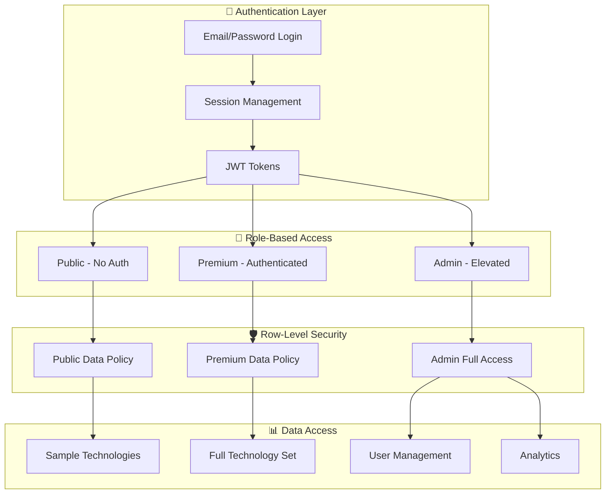
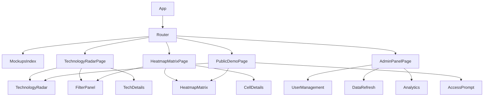

# Architecture Diagrams
## AI-CE Heatmap Platform - System Design

---

## System Overview



---

## Frontend Architecture



---

## Security Architecture



---

## Component Hierarchy



---

## API Layer

```mermaid
graph LR
    subgraph Client["Frontend"]
        A[Supabase Client]
    end
    
    subgraph API["API Endpoints"]
        B[/auth/*]
        C[/rest/v1/technologies]
        D[/rest/v1/scores]
        E[/rest/v1/profiles]
        F[/functions/v1/data-refresh]
        G[/functions/v1/export-pdf]
    end
    
    subgraph DB["Database"]
        H[(PostgreSQL)]
    end
    
    A --> B
    A --> C
    A --> D
    A --> E
    A --> F
    A --> G
    
    C --> H
    D --> H
    E --> H
    F --> H
    G --> H
```
