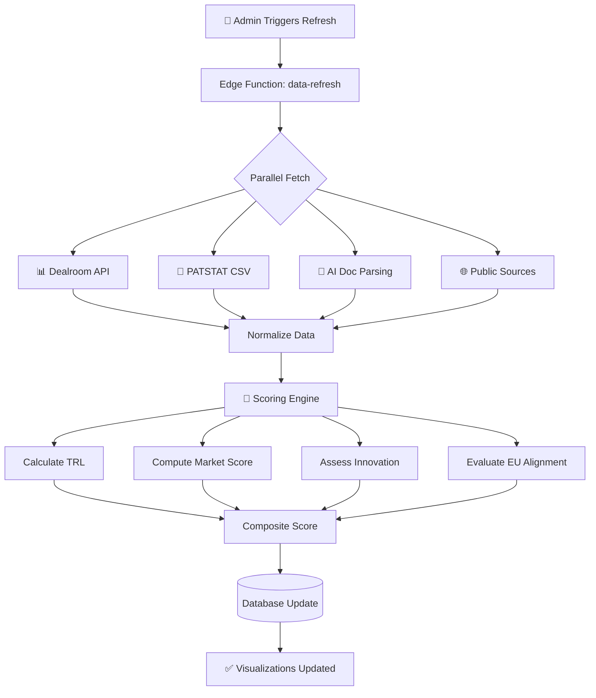
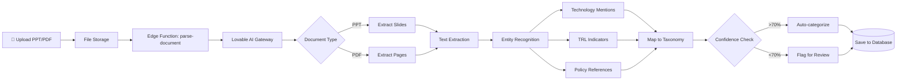
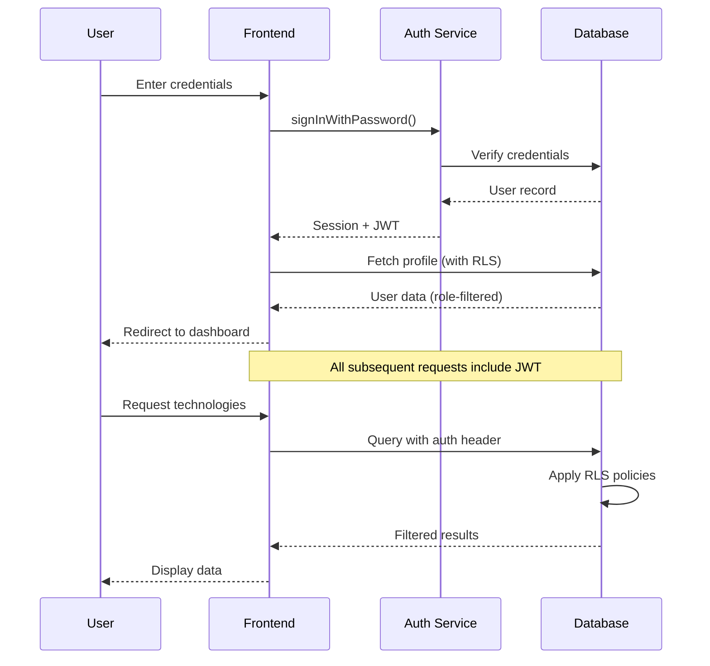
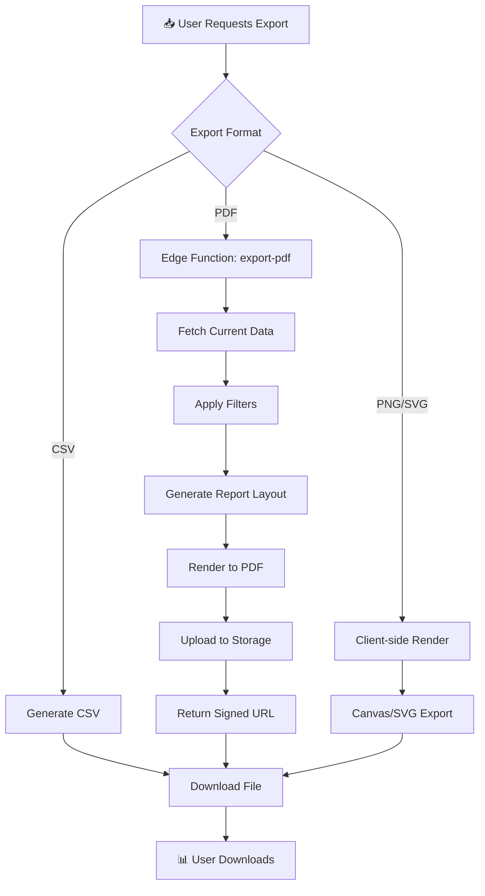
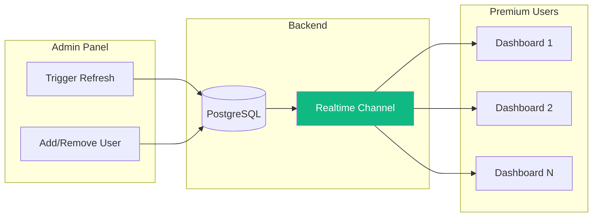
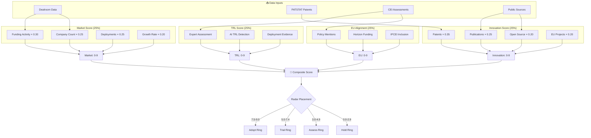

# Data Flow Diagrams
## AI-CE Heatmap Platform - Data Processing Pipeline

---

## Data Refresh Flow

---

## AI Document Processing

---

## User Authentication Flow

---

## Data Export Flow

---

## Real-time Data Sync

---

## Scoring Calculation Flow

