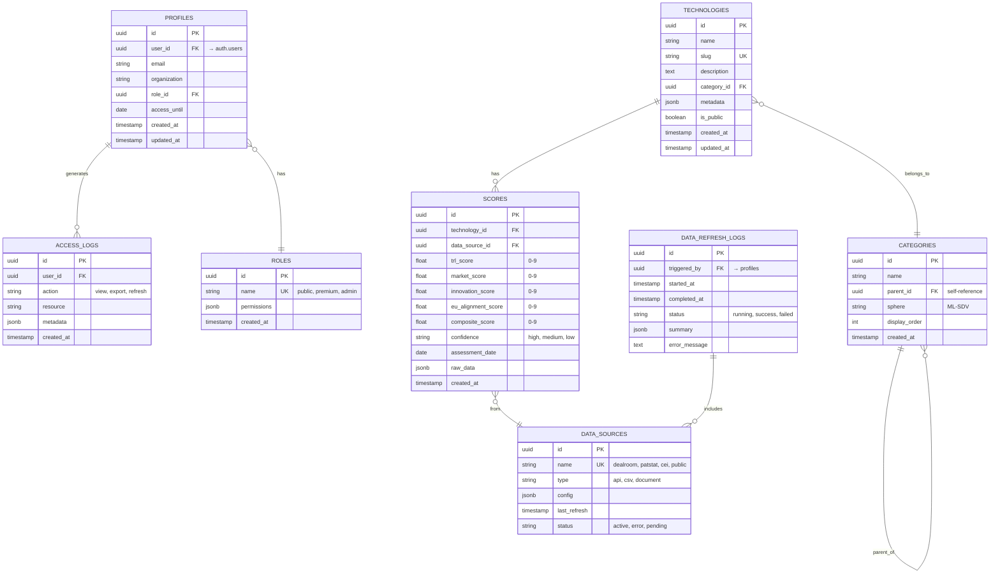
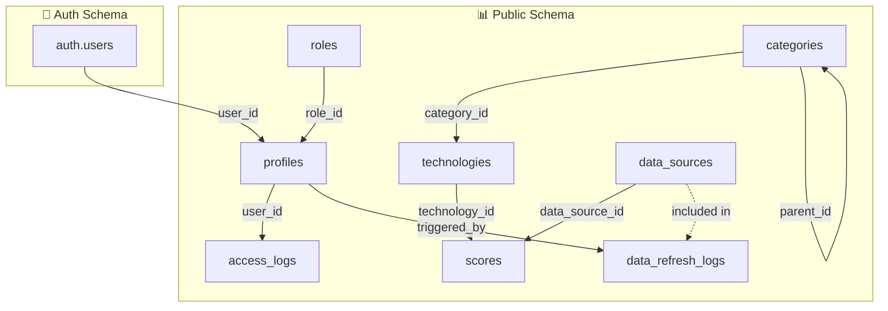
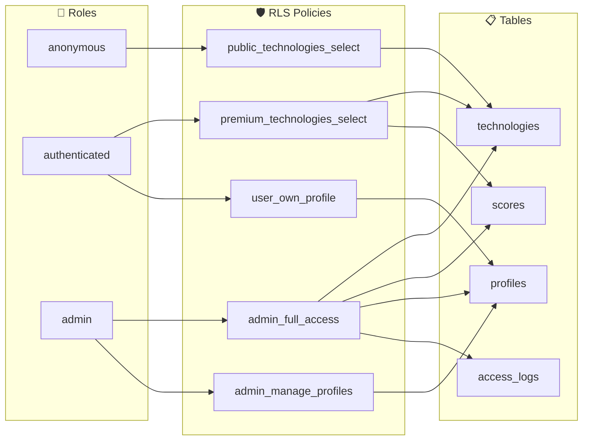
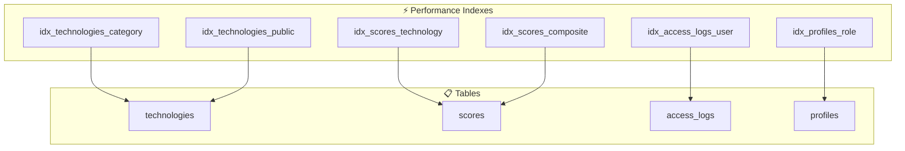

# Database Schema
## AI-CE Heatmap Platform - Entity Relationship Diagram

---

## Entity Relationship Diagram



---

## Table Relationships



---

## Row-Level Security Policies



---

## Index Strategy



---

## Data Types Reference

| Table | Column | Type | Notes |
|-------|--------|------|-------|
| profiles | permissions | JSONB | `{"export": true, "api": false}` |
| technologies | metadata | JSONB | `{"funding_total": 1000000, "patent_count": 15}` |
| scores | raw_data | JSONB | Source-specific raw data for audit |
| data_sources | config | JSONB | API keys, endpoints, auth config |
| data_refresh_logs | summary | JSONB | `{"records_updated": 150, "errors": 2}` |

---

## Enums

```sql
-- Role names
CREATE TYPE role_name AS ENUM ('public', 'premium', 'admin');

-- Access log actions
CREATE TYPE log_action AS ENUM ('view', 'export', 'filter', 'refresh', 'login');

-- Confidence levels
CREATE TYPE confidence_level AS ENUM ('high', 'medium', 'low');

-- Refresh status
CREATE TYPE refresh_status AS ENUM ('pending', 'running', 'success', 'failed');

-- Data source types
CREATE TYPE source_type AS ENUM ('api', 'csv', 'document', 'manual');
```
